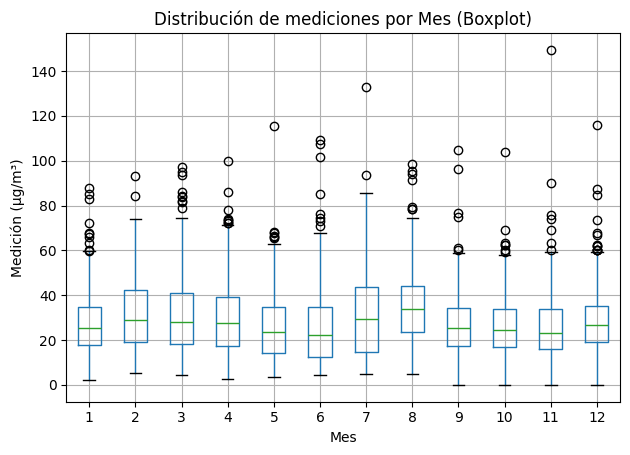

# 4. Exploración de los datos

## Completitud
El conjunto de datos contiene **5047 registros** con las siguientes columnas:
- Municipio
- Estación
- Fecha
- Diámetro aerodinámico
- Medición (µg/m³)

Durante la revisión inicial se identificaron únicamente **4 valores faltantes** en la columna `Medicion`, lo cual no compromete el análisis.  
El resto de variables no presenta valores nulos.

## Limpieza de datos
Se realizaron los siguientes ajustes:
- Conversión de `Fecha` a formato datetime.
- Conversión de `Medicion` a valor numérico.
- Creación de variables derivadas de `Fecha`:  
  - `Dia`, `Mes`, `Año` y `DiaSemana` (ordenados de lunes a domingo).
- Se guardó un dataset enriquecido en `data/processed/Calidad_del_Aire_enriquecido.csv`.

---

# 4. Análisis Descriptivo y Visualizaciones

## Estadísticas descriptivas por municipio
Archivo: `reports/resumen_por_municipio.csv`

| Municipio            | Media | Std   | Min | 25%  | 50%  | 75%  | Max   |
|----------------------|-------|-------|-----|------|------|------|-------|
| Dosquebradas         | 30.18 | 17.17 | 1.0 | 15.36| 28.80| 40.82| 116.0 |
| La Virginia          | 22.80 | 10.55 | 0.0 | 15.61| 21.40| 27.87| 73.31 |
| Pereira              | 28.59 | 15.47 | 0.0 | 18.94| 25.58| 34.93| 149.59|
| Santa Rosa de Cabal  | 30.57 | 14.04 | 3.65| 18.95| 30.24| 40.10| 75.16 |

**Hallazgos**:  
- Pereira presenta la mayor variabilidad (desviación estándar = 15.47).  
- Se detectan valores atípicos con concentraciones superiores a 100 µg/m³.  

## Visualizaciones generadas

- **Distribución de mediciones PM10 por municipio**  
  
  → Muestra que la mayoría de valores se concentran entre 10 y 40 µg/m³.

- **Serie temporal por estación**  
   
  → Se identifican picos de contaminación en Pereira y Dosquebradas.

- **Promedio de mediciones por día de la semana**  
   
  → Se observa ligera variación entre semana y fines de semana.

- **Promedio de mediciones por mes**  
  
  → Sugiere estacionalidad en los niveles de PM10.

- **Heatmap (Mes × Día de la semana)**  
   
  → Permite identificar combinaciones críticas de mes y día con mayores valores promedio.

- **Boxplot por mes**  
  
  → Evidencia la dispersión y outliers, especialmente en meses con picos altos.

- **Boxplot por día de la semana**  
  
  → Confirma variabilidad moderada, con algunos días más críticos.

---

## Conclusiones iniciales
- La calidad del aire es variable entre municipios.
- Existen episodios de contaminación alta (superiores a 100 µg/m³).  
- Los patrones temporales (día de la semana y mes) aportan información para identificar estacionalidad y planificar estrategias de control.  
- El dataset está limpio y completo, listo para análisis más avanzados (modelado, pronóstico o correlaciones).